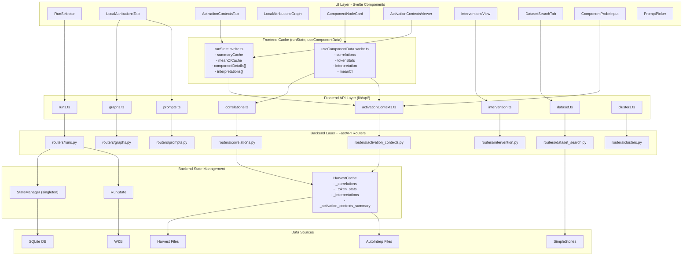

# SPD App Data Flow Analysis

## Visual Overview



---

## 1. Frontend Caching Strategy

### Global Cache (runState.svelte.ts)

Cached per loaded run, cleared when run changes:

| Cache | Type | Purpose |
|-------|------|---------|
| `summaryCache` | `Loadable<ActivationContextsSummary>` | Full summary data |
| `meanCICache` | `Record<"layer:cIdx", number>` | O(1) mean CI lookups |
| `componentDetails` | `Record<"layer:cIdx", Loadable<ComponentDetail>>` | Full activation contexts |
| `interpretations` | `Record<"layer:cIdx", Interpretation>` | LLM labels |

### Local Component Cache (useComponentData.svelte.ts)

Per-component fetches with stale request cancellation:

| State | Type | Source |
|-------|------|--------|
| `correlations` | `Loadable<ComponentCorrelations>` | `/api/correlations/components/{layer}/{idx}` |
| `tokenStats` | `Loadable<TokenStats>` | `/api/correlations/token_stats/{layer}/{idx}` |
| `interpretation` | `InterpretationState` | `/api/correlations/interpretations/{layer}/{idx}` |
| `meanCI` | `Loadable<number>` | Cached via `runState.getMeanCI()` |

---

## 2. Backend State Management

### StateManager (Singleton)

```python
db: LocalAttrDB              # SQLite connection
run_state: RunState | None   # Current loaded run
dataset_search_state: DatasetSearchState | None  # Cached search results
```

### RunState

```python
run: Run                     # Metadata (id, wandb_path)
model: ComponentModel        # Loaded on GPU
tokenizer: PreTrainedTokenizerFast
sources_by_target: dict[str, list[str]]  # Valid gradient paths
config: Config               # SPD config from W&B
token_strings: dict[int, str]  # Vocab lookup
context_length: int
harvest: HarvestCache        # Lazy-loads harvest data
```

### HarvestCache (Lazy-Loading with Sentinel Pattern)

On first access, loads from disk and caches:

| Property | Loader | File |
|----------|--------|------|
| `correlations` | `load_correlations()` | `SPD_OUT_DIR/harvest/{run}/correlations/component_correlations.pt` |
| `token_stats` | `load_token_stats()` | `SPD_OUT_DIR/harvest/{run}/correlations/token_stats.pt` |
| `interpretations` | `load_interpretations()` | `SPD_OUT_DIR/autointerp/{run}/results.jsonl` |
| `activation_contexts_summary` | `load_activation_contexts_summary()` | `SPD_OUT_DIR/harvest/{run}/activation_contexts/summary.json` |

---

## 3. API Endpoints by Router

### routers/runs.py (Run Management)

| Endpoint | Method | Purpose |
|----------|--------|---------|
| `/api/runs/load` | POST | Load W&B run, build model |
| `/api/status` | GET | Get current loaded run info |
| `/api/health` | GET | Health check |
| `/api/whoami` | GET | Get backend user |

### routers/graphs.py (Attribution Computation)

| Endpoint | Method | Purpose |
|----------|--------|---------|
| `/api/graphs` | POST | Compute attribution graph (SSE stream) |
| `/api/graphs/optimized/stream` | POST | Compute sparse optimized graph (SSE) |
| `/api/graphs/{id}` | GET | Retrieve stored graphs |
| `/api/graphs/tokenize` | POST | Tokenize text preview |
| `/api/graphs/tokens` | GET | Full vocabulary |

### routers/activation_contexts.py (Component Firing Patterns)

| Endpoint | Method | Purpose |
|----------|--------|---------|
| `/api/activation_contexts/summary` | GET | Lightweight component index |
| `/api/activation_contexts/{layer}/{idx}` | GET | Full activation context detail |
| `/api/activation_contexts/probe` | POST | Compute CI on custom text |

### routers/correlations.py (Component Analysis)

| Endpoint | Method | Purpose |
|----------|--------|---------|
| `/api/correlations/components/{layer}/{idx}` | GET | Co-occurrence correlations |
| `/api/correlations/token_stats/{layer}/{idx}` | GET | Token associations |
| `/api/correlations/interpretations` | GET | All interpretation labels |
| `/api/correlations/interpretations/{layer}/{idx}` | GET | Single interpretation |
| `/api/correlations/interpretations/{layer}/{idx}` | POST | Generate on-demand |

### routers/prompts.py (Prompt Management)

| Endpoint | Method | Purpose |
|----------|--------|---------|
| `/api/prompts` | GET | List all prompts |
| `/api/prompts/generate` | POST | Generate from dataset (SSE) |
| `/api/prompts/search` | GET | Search by active components |
| `/api/prompts/custom` | POST | Create custom prompt |

### routers/intervention.py (Component Manipulation)

| Endpoint | Method | Purpose |
|----------|--------|---------|
| `/api/intervention/run` | POST | Run and save intervention |
| `/api/intervention/runs/{id}` | GET | List saved interventions |
| `/api/intervention/runs/{id}` | DELETE | Delete intervention |
| `/api/intervention/runs/{id}/fork` | POST | Fork with token replacements |

### routers/dataset_search.py (SimpleStories)

| Endpoint | Method | Purpose |
|----------|--------|---------|
| `/api/dataset/search` | POST | Search dataset |
| `/api/dataset/results` | GET | Paginated results |

### routers/clusters.py (Component Clustering)

| Endpoint | Method | Purpose |
|----------|--------|---------|
| `/api/clusters/load` | POST | Load cluster mapping |

---

## 4. Key User Flows

### A. Run Loading
```
RunSelector
  → api.loadRun(wandbPath, contextLength)
  → POST /api/runs/load
  → Backend loads model from W&B
  → Stores in StateManager.run_state
  → Frontend stores in runState.run
```

### B. Graph Computation
```
LocalAttributionsTab
  → api.computeGraphStreaming(promptId, params)
  → POST /api/graphs (SSE)
  → compute_local_attributions()
  → Streams progress updates
  → Returns GraphData (edges, CI values, probs)
  → Saves to DB
```

### C. Component Details (Hover/Pin)
```
ComponentNodeCard
  → useComponentData({ layer, cIdx })
  → Parallel fetches:
      1. runState.getMeanCI() → cached or GET /api/activation_contexts/summary
      2. getComponentCorrelations() → GET /api/correlations/components/{layer}/{idx}
      3. getComponentTokenStats() → GET /api/correlations/token_stats/{layer}/{idx}
      4. getComponentInterpretation() → GET /api/correlations/interpretations/{layer}/{idx}
```

### D. Activation Contexts Tab
```
ActivationContextsTab
  → runState.getActivationContextsSummary()
  → GET /api/activation_contexts/summary (if not cached)
  → Caches in summaryCache + meanCICache

ActivationContextsViewer (on page change)
  → runState.loadComponentDetail(layer, cIdx)
  → GET /api/activation_contexts/{layer}/{idx} (if not cached)
  → Caches in componentDetails
```

### E. Intervention
```
InterventionsView
  → Select nodes in graph
  → api.runAndSaveIntervention(graphId, nodeKeys, label)
  → POST /api/intervention/run
  → compute_intervention_forward()
  → Saves to DB
```

---

## 5. Caching Summary

| Layer | What | Where | Lifetime |
|-------|------|-------|----------|
| Frontend | Summary + meanCI | `runState.summaryCache/meanCICache` | Until run changes |
| Frontend | Component details | `runState.componentDetails` | Until run changes |
| Frontend | Interpretations | `runState.interpretations` | Until run changes |
| Frontend | Per-component data | `useComponentData` local state | While component mounted |
| Backend | Harvest data | `HarvestCache` properties | Until run unloaded |
| Backend | Graphs | SQLite DB | Indefinite |
| Backend | Dataset search | `StateManager.dataset_search_state` | Until next search |

---

## 6. Known Issues / Observations

### Duplicate Fetching
Two systems fetch component data:
1. `useComponentData` hook (ComponentNodeCard) - correlations, tokenStats, interpretation
2. `loadComponentDetail` (ActivationContextsViewer) - full activation contexts

### Effect Re-running
`ActivationContextsViewer` has an `$effect` that calls `loadComponentDetail` which may re-run unexpectedly due to derived state changes.

### Cache Invalidation
- Frontend caches cleared on run change via `runState.clear()`
- Backend HarvestCache uses sentinel pattern - loads once per run
- No cache invalidation for individual components (by design)
