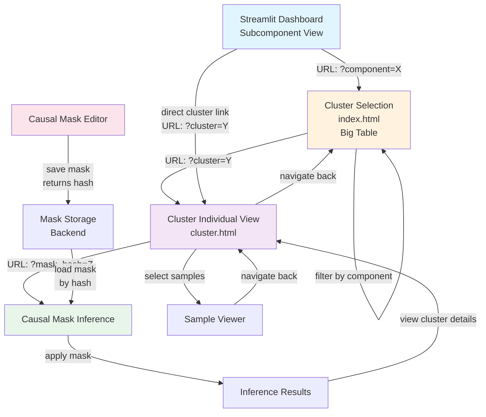

# 2025-10-02 15:17

For cluster view:

- SAE/logitlens/tunedlens decoding of read and write directions for each cluster
- github comments interface
- more plots
- base frequency of each token in dataset
- do some kind of clustering on tokens via embedding space, to label their groups. ideally so we can make a histogram of which groups of tokens this cluster activates on
- measure of how "concentrated" the subcomponents are per module
- measure of depth in the model
- measure of how "attention-y" vs "MLP-y" the clusters subcomponents are
- skewed vs uniform activation frequencies, skewed vs uniform max act position
    - maybe not max act pos, but overall mass across positions

For list view (or wandb view?):

- stats of tok concentration, entropy, subcomp in module concentration, etc across all clusters
- some kind of embedding of clusters, 3d view, click on pt to go to cluster view

# old 

# Design doc

We have several interfaces:

- streamlit subcomponent dashboard
- cluster selection interface (big table) [`index.html`](index.html)
- cluster individual view [`cluster.html`](cluster.html)
- inference with causal masks

rather than trying to put these all into one interface, we should instead:

- ensure that we can specify via URL various parameters specifying which cluster/component/causal mask/sample/etc we are looking at
   - using cookies/local storage/something server side to do this adds more complexity, makes it less observable to the user, and makes sharing specific views harder
- link between these interfaces using these URLs in some reasonable way

## Interface Flow Diagram

# cluster explanations:

- have a separate repo for cluster dashboard (heavy data)
- on each cluster page, have links to create an issue with prefilled info about that cluster and specially formatted title
    - it also searches for existing issues with that title, and links to them
    - potentially rate limit issue. if this is the case, we have a cron job action on the repo which checks for all issues and commits their info to a file. interface by default reads from that file, user hits a button to refresh issues from github (js running in browser makes requests filtered by timestamp)
    - database/big json file on the server of explanations? this should also be how we store autointerp explanations

# TODO

## static:

- makeup of activations on a per-subcomponent basis
- makeup of clusters -- which modules do they have subcomponents from?
- [ ] features in 2d plane -- display them as vector fields, with points in that 2d plane colored corresponding to various SAE features

## interactive:

minimal example: put in a piece of text, it computes cluster activations on it

# causal masks

one of the things we might want to do is:

- define a causal mask, using:
	- some subset of the data (a set of prompts)
	- some other method
- run inference using that particular causal mask on some other dataset

this requires an easy way to define and use custom causal masks. a good solution might be something like:

- interface to define a causal mask, by providing a dataset and/or manually editing
	- it should have a button to "label" a causal mask -- probably, we can hash the causal mask, save the mask to a file on the backend, and use that hash as a key
	- copy the hash
- in other interfaces for doing inference with the mask, we can paste the hash to specify a causal mask
