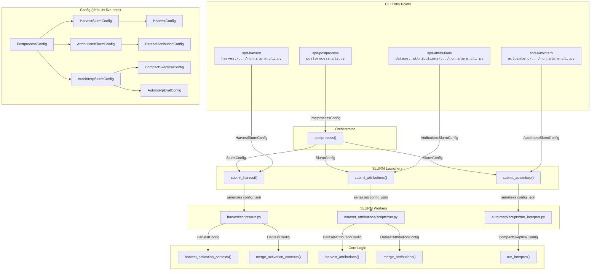
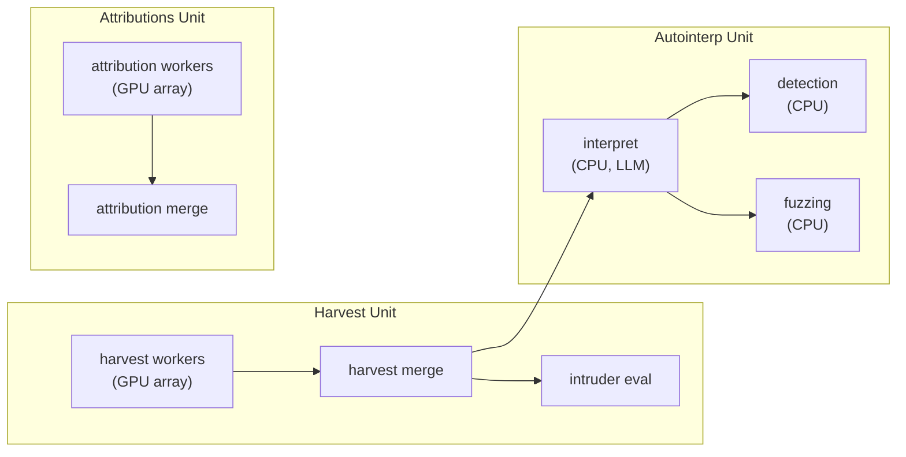
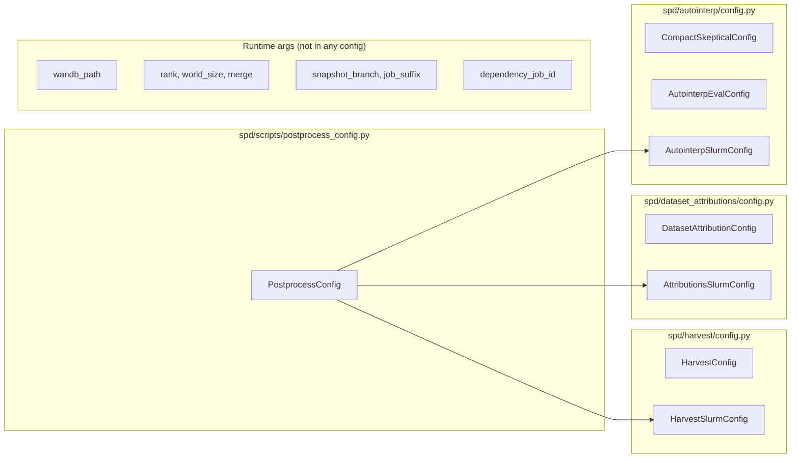

# Postprocess Architecture

## Call Graph

```mermaid
graph TD
    subgraph "CLI Entry Points"
        PP_CLI["spd-postprocess<br/><code>postprocess_cli.py</code>"]
        H_CLI["spd-harvest<br/><code>harvest/.../run_slurm_cli.py</code>"]
        A_CLI["spd-attributions<br/><code>dataset_attributions/.../run_slurm_cli.py</code>"]
        AI_CLI["spd-autointerp<br/><code>autointerp/.../run_slurm_cli.py</code>"]
    end

    subgraph "Config (defaults live here)"
        PC["PostprocessConfig"]
        HSC["HarvestSlurmConfig"]
        ASC["AttributionsSlurmConfig"]
        AISC["AutointerpSlurmConfig"]
        HC["HarvestConfig"]
        DAC["DatasetAttributionConfig"]
        CSC["CompactSkepticalConfig"]
        AEC["AutointerpEvalConfig"]

        PC --> HSC & ASC & AISC
        HSC --> HC
        ASC --> DAC
        AISC --> CSC & AEC
    end

    subgraph "Orchestrator"
        PP["postprocess()"]
    end

    subgraph "SLURM Launchers"
        H_SLURM["submit_harvest()"]
        A_SLURM["submit_attributions()"]
        AI_SLURM["submit_autointerp()"]
    end

    subgraph "SLURM Workers"
        H_RUN["harvest/scripts/run.py"]
        A_RUN["dataset_attributions/scripts/run.py"]
        AI_RUN["autointerp/scripts/run_interpret.py"]
    end

    subgraph "Core Logic"
        H_CORE["harvest_activation_contexts()"]
        H_MERGE["merge_activation_contexts()"]
        A_CORE["harvest_attributions()"]
        A_MERGE["merge_attributions()"]
        AI_CORE["run_interpret()"]
    end

    PP_CLI -- "PostprocessConfig" --> PP
    PP -- "SlurmConfig" --> H_SLURM & A_SLURM & AI_SLURM

    H_CLI -- "HarvestSlurmConfig" --> H_SLURM
    A_CLI -- "AttributionsSlurmConfig" --> A_SLURM
    AI_CLI -- "AutointerpSlurmConfig" --> AI_SLURM

    H_SLURM -- "serializes config_json" --> H_RUN
    A_SLURM -- "serializes config_json" --> A_RUN
    AI_SLURM -- "serializes config_json" --> AI_RUN

    H_RUN -- "HarvestConfig" --> H_CORE & H_MERGE
    A_RUN -- "DatasetAttributionConfig" --> A_CORE & A_MERGE
    AI_RUN -- "CompactSkepticalConfig" --> AI_CORE
```

## SLURM Dependency Graph

```mermaid
graph LR
    subgraph "Harvest Unit"
        HW["harvest workers<br/>(GPU array)"]
        HM["harvest merge"]
        IE["intruder eval"]
        HW --> HM --> IE
    end

    subgraph "Autointerp Unit"
        INT["interpret<br/>(CPU, LLM)"]
        DET["detection<br/>(CPU)"]
        FUZ["fuzzing<br/>(CPU)"]
        INT --> DET & FUZ
    end

    subgraph "Attributions Unit"
        AW["attribution workers<br/>(GPU array)"]
        AM["attribution merge"]
        AW --> AM
    end

    HM --> INT
```

## Config File Locations

```mermaid
graph LR
    subgraph "spd/harvest/config.py"
        HC2["HarvestConfig"]
        HSC2["HarvestSlurmConfig"]
    end

    subgraph "spd/dataset_attributions/config.py"
        DAC2["DatasetAttributionConfig"]
        ASC2["AttributionsSlurmConfig"]
    end

    subgraph "spd/autointerp/config.py"
        CSC2["CompactSkepticalConfig"]
        AEC2["AutointerpEvalConfig"]
        AISC2["AutointerpSlurmConfig"]
    end

    subgraph "spd/scripts/postprocess_config.py"
        PC2["PostprocessConfig"]
    end

    PC2 --> HSC2 & ASC2 & AISC2

    subgraph "Runtime args (not in any config)"
        R1["wandb_path"]
        R2["rank, world_size, merge"]
        R3["snapshot_branch, job_suffix"]
        R4["dependency_job_id"]
    end
```
